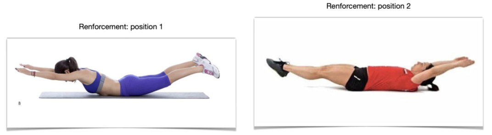

## Leçon Gym 1/2

| Champ                         | Donnée |
|-------------------------------|---|
| Date:                         | mardi 28.11.23 |
| Durée:                        | 100 min (13:30-15:10) |
| Classe:                       | 6H |
| Domaine d'apprentissage:      | Gym |
| Thème - sujet:                | Barre fixe et dribble |
| Phase-s (temps, situation-s): | découverte et entrainement |
| Conditions:                   | 19 élèves, pas d'élèves à difficultés physiques connues|
| Objectifs généraux (PER):     | [CM-21](CM-21.md)|
| Objectif-s spécifique-s:      | Les élèves sont capables de faire une roulade avant à la barre fixe; ils sont capables de dribbler à hauteur de taille en se déplaçant, sans perdre la balle |

## 1. Echauffement

| Durée | Forme | Rôle ens. | Intentions | Moyens |
|:----- |:----- |:--------- |:---------- |:------ |
| 20 min | Collective | Animer | Echauffement, attention | Ballons de basket + sautoirs |

- Cardio:
	- Les élèves courent librement dans la salle en effectuant les pas montrés par l'adulte (genoux montent, pieds frappent derrière, courir en arrière, agiter les bras, etc.)
- Renforcement:
	- Renforcement (nouveau): Travailler les 2 position ci- dessous (voir photos) puis passer de l’une à l’autre sans que mains ni pieds ne touchent le sol.
- Salade fruits:
	- Créer 4 groupes et leur attribuer des sautoirs
	- Chaque élève prend un ballon
	- Consigne:
		- Sautoirs rouges: fraises / verts: kiwi / jaune: banane / bleu: cassis
		- Groupes aux 4 coins de la salle
		- L'adulte indique 2 noms de fruits: les 2 groupes correspondants se croisent en dribblant (ils vont prendre la place de l'autre groupe)
		- A l'annonce "salade de fruits", les 4 groupes se croisent en diagonale, simultanément

## 2. Ateliers dribble + barre fixe

| Durée | Forme | Rôle ens. | Intentions | Moyens |
|:----- |:----- |:--------- |:---------- |:------ |
| 40 min| 2 ateliers | Barre fixe (2 adultes): Coaching individuel + faire passer un test • Slalom dribble (1 adulte): consigne puis coaching individuel des|  Coaching individuel + faire passer le test. • Slalom dribble (1 adulte): consigne puis coaching individuel des Barre fixe: Consolider les acquis, introduction du funambule Dribble: Consolidation du dribble, être capable de dribbler sans taper le ballon, de s’arrêter et de repartir en dribblant. Introduction aux passes et à la défense| 3 barres fixes, 21 ballons de basket, obstacles |

- Mise en place (10 min, collectif):
	- Barres fixes, matelas, parcours de basket « slalom dribble »
- Ateliers (20 min chacun):
	- Groupe 1 :
		- Barre fixe – Répétition du cochon pendu, roulade avant, paresseux, funambule sur une barre placée près du sol: se déplacer de toutes les manières possibles, sans perdre l’équilibre.
			- Développement: Tester pour chaque élève l’objectif de tenir 15 secondes en perroquet, bras et corps bien tendu, mains dans la bonne position (paume dessus).
	- Groupe 2:
		- Slalom dribble dans le reste de la salle. Parcours d’obstacles (caissons, poteaux, cônes, etc) avec tir au panier final. Dribble main gauche, main droite, des deux mains.
			- Développement: L’enseignant coache individuellement les enfants dont le dribble n’est pas en place, par exemple s’ils frappent la balle ou la perdent régulièrement.
	- Rangements (10 min)

## 3. Retour au calme

| Durée | Forme | Rôle ens. | Intentions | Moyens |
|:----- |:----- |:--------- |:---------- |:------ |
| 20 min | Duo | Consigne puis animation | Retour au calme | Eventuelement Musique calme et haut-parleur bluetooth (Arnaud) |

- Miroir (10 min):
	- Les duos se mettent debout face-à-face. Ils décident qui fait le miroir de l’autre. Quand la musique commence, les « sujets » animent leur corps au ralenti, doigts, mains, bras, tête, tronc, jambes etc et le miroir imite de manière aussi synchrone et précise que possible. Echanger les rôles au sein du duo.
- Douches (10 min)

---
## Analyse

**Analyse a priori:**
(Facteurs contrariants découlant de difficultés liées à l'apprentissage, au comportement, au matériel, au temps)

- Si les élèves ne savent pas monter le matériel (par exemple barres fixes):
	- faire un démonstration. S'assurer que celles et ceux qui les transportent ont des chaussures.
- Salade fruits: dans le vacarme des ballons, des élèves pourraient ne pas entendre les ordres du meneur de jeu:
	- utiliser un sifflet ou un tambourin
- Pour éviter la confusion lors de la mise en place des ateliers:
	- Utiliser les équipes formées pour la salade de fruits (sautoirs):
		1. Barres fixes
		2. Matelas
		3. Poteaux slalom
		4. Ballons

**Evaluation formative et différenciation:**

- Pas de différenciation anticipée en l'absence d'informations sur les capacités physiques individuelles.

**Analyse a posteriori:**

## Annexes:

